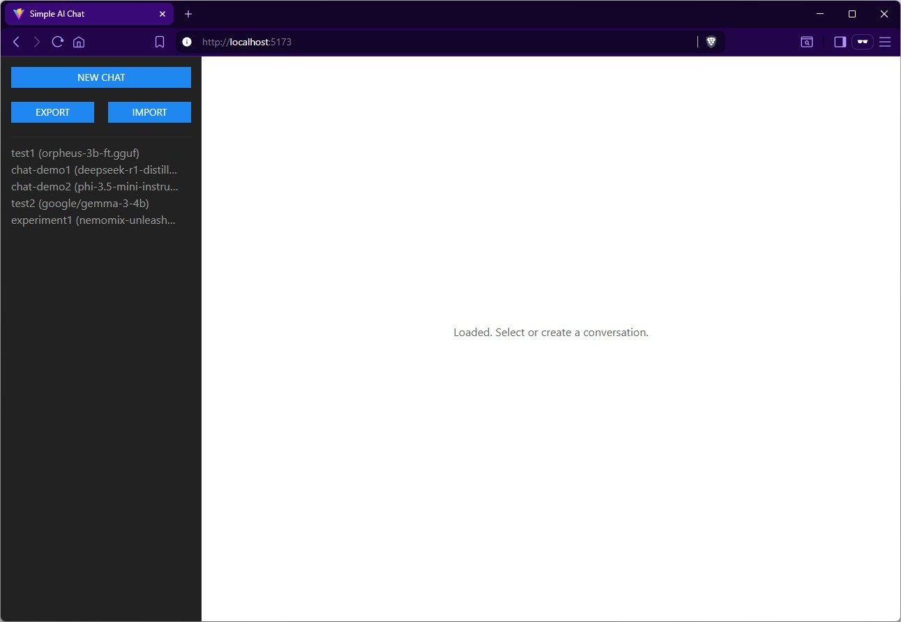
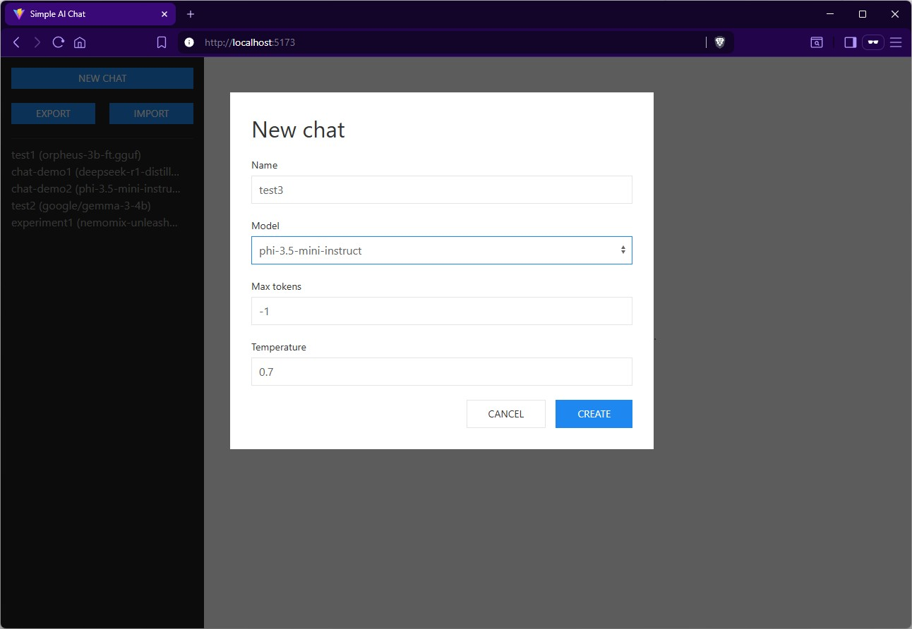
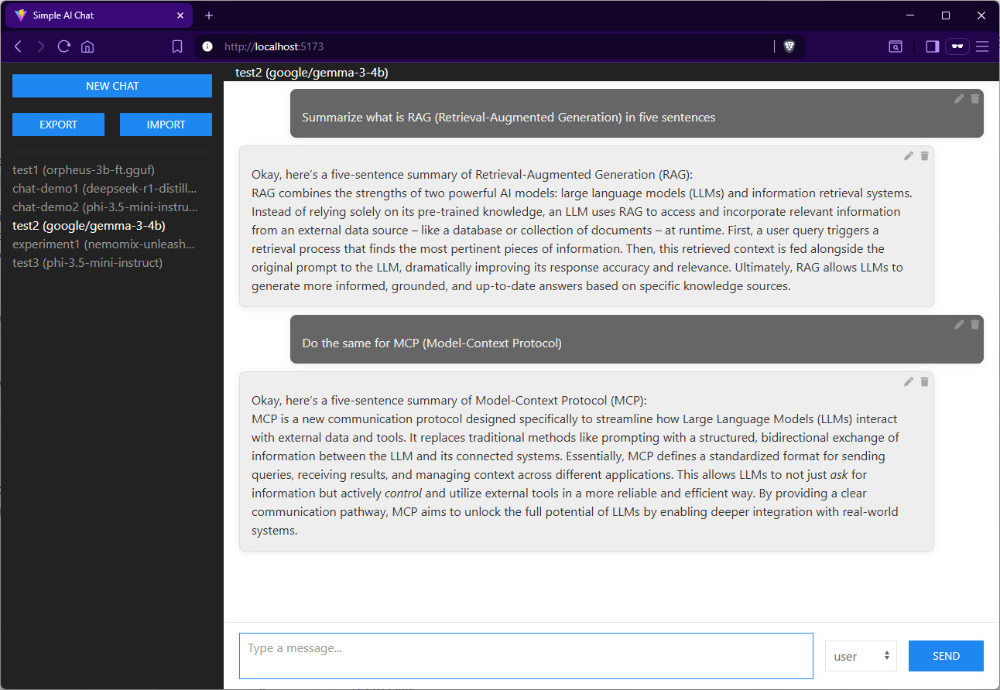

# Simple AI Chat

A compact, developer-focused example of building a minimal local chat interface that integrates with a local LLM backend ([LM Studio](https://lmstudio.ai)).

## Features
- Svelte SPA, providing two modes for communicating with LM Studio:
  - Browser-only mode (default): GUI talks directly to LM Studio and stores chats in IndexedDB.
  - Python proxy mode: an optional lightweight Flask proxy that provides file-based persistence (JSON) and forwards streaming responses from LM Studio.
- handling streaming response with Streams API
- edit/delete messages
- import/export conversations





## Stack

- Frontend: [Svelte 5](https://svelte.dev/), [TypeScript](https://typescriptlang.org) (building: [Vite](https://vite.dev))
- Design: [UIkit](https://getuikit.com) + [Font Awesome](https://fontawesome.com)
- Optional proxy: Python (Flask)

## Configuration

In an environment file (.env) in the root, you can adjust the following properties:

| Environment Variable | Description | Default Value |
|---------------------|-------------|---------------|
| VITE_MIDDLEWARE | Middleware type: `local` (no middleware) or `python` | `local` |
| VITE_LM_STUDIO_URL | LM Studio API endpoint URL | `http://localhost:1234/v1` |
| VITE_PYTHON_PROXY_URL | Python proxy server URL | `http://localhost:8080` |

Example:
```
VITE_MIDDLEWARE=local
VITE_LM_STUDIO_URL=http://localhost:1234/v1
VITE_PYTHON_PROXY_URL=http://localhost:8080
```

## How to use the python proxy

The app reads its configuration from environment variables

- set VITE_MIDDLEWARE to "python"
- in the ./python_proxy directory, follow the README to prepare and start the proxy


## Installing, building

The build is managed by Vite, the standard commands are available.

```npm install```

```npm run build```

## Running

Prerequisite: 
LM Studio server must installed and running. It can be started either from its UI or by the command 

```lms server start --cors```

Then run the app by 

```npm run dev```
